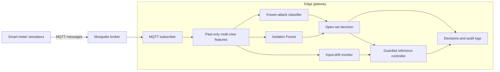

# Lightweight Multi-View and Drift-Aware Edge Framework for FDI Detection

This repository implements a prototype for detecting known and withheld
false-data injection attacks in smart-grid IoT communications. An edge gateway
jointly analyses measurement values, temporal behaviour and MQTT protocol
context. A separate drift-monitoring path supports controlled approval and
bounded statistical-reference updates without retraining the Logistic
Regression classifier, scaler or Isolation Forest online.

## Research question

> To what extent can a lightweight edge-based detector identify known and
> previously unseen false-data injection attacks by jointly analysing IoT
> message values, temporal behaviour and protocol-level communication patterns,
> while providing resilience to selected legitimate input drifts under
> controlled approval?

## Implemented contributions

- Reproducible Mosquitto testbed with three simulated smart meters.
- Constant, random, replay and topic-spoof known attacks.
- Gradual manipulation withheld from all fitted components and evaluated as
  unseen.
- Forty-eight past-only value, temporal and MQTT protocol features.
- Grouped train/validation/test evaluation by complete source run.
- Logistic Regression and Random Forest accuracy-efficiency comparison.
- Confidence rejection plus a normal-only Isolation Forest for open-set
  decisions.
- Raspberry Pi 5 evaluation covering accuracy, latency, throughput, CPU,
  memory, parity and thermal behaviour.
- Two-sided Page-Hinkley-style input-drift monitoring, controlled approval and
  bounded statistical-reference updates.

## Architecture



The drift monitor is a side path. A drift event does not authorise an update by
itself. Approved updates affect logged statistical references and the guarded
operational status; they do not change the learned detector or overwrite the
recorded raw decision.

## Feature views

| View | Examples | Primary evidence |
|---|---|---|
| Value | measurements, changes, rolling statistics, z-scores, power consistency | constant, random and gradual manipulation |
| Temporal | source/arrival intervals, sequence continuity, repeated-value runs | replay and timing behaviour |
| Protocol | topic, QoS, retain, payload size, device-topic/client-topic relations | topic spoofing and communication anomalies |

All rolling features use the current message and past per-device state only.
Ground-truth attack and drift fields are excluded from inference.

## Environment

Requirements:

- Python 3.11
- Mosquitto broker and command-line clients
- Conda or another Python environment manager

Create and verify the environment:

```bash
conda env create -f environment.yml
conda activate smartgrid-fdi
python -m pytest -q
```

## Released data and artifacts

The main source tag, `dissertation-v1.0`, contains the audited code,
configuration and compact results. The `dissertation-artifacts-v1.0` tag adds
the raw and processed datasets, trained models, predictions and complete
machine-readable results.

Download the artifact bundle:

<https://github.com/pengbo960/Smartgrid-fdi-edge/raw/refs/tags/dissertation-artifacts-v1.0/artifacts/smartgrid-fdi-edge-artifacts-dissertation-v1.0.zip>

See [ARTIFACT_RELEASE.md](ARTIFACT_RELEASE.md) for the bundle manifest, dataset
audit, evaluation denominators, scope of the open-set and poisoning metrics,
and checksum verification commands.

## MQTT smoke test

Start Mosquitto:

```bash
mosquitto -v
```

In a second terminal, start collection:

```bash
python scripts/collect_dataset.py \
  --output data/raw/normal_smoke.csv
```

In a third terminal, publish a short normal scenario:

```bash
python scripts/run_simulator.py \
  --scenario config/scenarios/normal.yaml \
  --duration 20 \
  --interval 0.5
```

Available scenario families are normal, constant, random, gradual, replay and
topic spoof.

## Reproduce the formal offline experiments

The released artifact bundle already contains the formal dataset and models.
To regenerate the dataset from MQTT, run:

```bash
make scenarios
make collect
make features
make validate
```

This collection stage runs 30 scenarios through a live broker and therefore
takes substantially longer than the smoke test.

Run the principal offline evaluations:

```bash
make ablation
make compare-models
make open-set
make repeated-experiments
make drift
make drift-repeated
make final-summary
```

`make repeated-experiments` performs five deterministic grouped folds. Within
each scenario family, one complete source run is used for testing, one for
validation and the remaining three for training. Fold `i` evaluates only
gradual run `i` as unseen; all gradual source files are excluded before fitting
and threshold calibration.

## Run the real-time detector

Train or restore the open-set artifacts, then start the detector:

```bash
make open-set
make edge-detector
```

Publish a scenario from another terminal, for example:

```bash
python scripts/run_simulator.py \
  --scenario config/scenarios/topic_spoof.yaml
```

Per-message output includes the known prediction, open-set decision,
confidence, anomaly score, drift status and processing latency. Processing
latency covers feature extraction and detector inference after message receipt;
it excludes MQTT and network transit time.

### Raspberry Pi live scenarios

The matched Raspberry Pi scenarios use a 0.5-second per-device publishing
interval:

- `config/scenarios/live_pi_normal.yaml`
- `config/scenarios/live_pi_constant.yaml`
- `config/scenarios/live_pi_replay.yaml`
- `config/scenarios/live_pi_topic_spoof.yaml`
- `config/scenarios/live_pi_gradual_extended.yaml`

`config/scenarios/live_pi_random.yaml` is available for additional testing but
was not included in the formal five-scenario live evaluation. Do not substitute
the one-second development scenarios for a matched deployment test: changing
the interval changes temporal features and introduces communication-rate
distribution shift.

## Edge benchmarks

The main benchmark targets are:

```bash
make edge-benchmark-repeated
make open-set-edge-benchmark-repeated
make platform-comparison
make fixed-rate-edge-benchmark
make normal-load-cpu-benchmark
make normal-load-cpu-platform-comparison
```

Saturation benchmarks estimate maximum single-process throughput and
intentionally approach 100% of one CPU core. Fixed-rate tests measure CPU and
deadline misses at controlled incoming rates. The formal normal load is six
messages/s: three devices publishing once every 0.5 seconds.

Use the corresponding `raspberry_pi_*.yaml` configuration on the Pi. Repeated
benchmark runs execute in fresh processes and exclude 34 warm-up messages per
device from timing.

## Drift experiments

Two legitimate input-drift scenarios are provided:

```bash
python scripts/run_simulator.py \
  --scenario config/scenarios/measurement_drift.yaml

python scripts/run_simulator.py \
  --scenario config/scenarios/communication_drift.yaml
```

Drift monitoring and reference updates are disabled by default in
`config/edge.yaml`. The dedicated `edge_drift_experiment.yaml` and
`raspberry_pi_edge_drift_experiment.yaml` configurations enable automatic
approval only for controlled experiments. Restart the detector between runs so
feature windows, drift state and temporary approvals are reset.

Summarise repeated live logs and compare platforms with:

```bash
make drift-live-repeated-summary
make drift-platform-comparison
```

The operational `normal_drift` overlay never replaces `raw_decision` in the
audit log. The poisoning experiment is a separate simplified reference-update
test, not an end-to-end poisoning evaluation of the complete detector.

## Key results

| Experiment | Result |
|---|---:|
| All-view Logistic Regression Macro-F1, five grouped folds | 0.9972 ± 0.0006 |
| Random Forest Macro-F1, five grouped folds | 0.9998 ± 0.0003 |
| Withheld gradual unknown recall, five grouped folds | 0.9533 ± 0.0131 |
| Known-data false-unknown rate, five grouped folds | 0.0196 ± 0.0032 |
| Raspberry Pi open-set saturation throughput | 33.34 messages/s |
| Raspberry Pi open-set CPU at the formal six-message/s load | 23.50 ± 0.51% of one core |
| Raspberry Pi live gradual unknown recall | 93.33% |
| Raspberry Pi live pooled normal alert rate | 1.80% |
| Raspberry Pi measurement-drift alert reduction, five runs | 19.13 ± 4.49% |
| Raspberry Pi communication-drift alert reduction, five runs | 99.11 ± 0.00% |
| Guarded versus unguarded reference movement | 1.21 V versus 7.22 V |

These results apply to the controlled three-device synthetic testbed. Only one
withheld attack family was evaluated. Drift approval was controlled, energy
consumption was not measured with an external power meter, and deployment
trials were limited in duration.

Consolidated results are stored under `results/final/`; grouped-fold summaries
are under `results/repeated/`; deployment and drift outputs are under
`results/edge/` and `results/drift/`.
