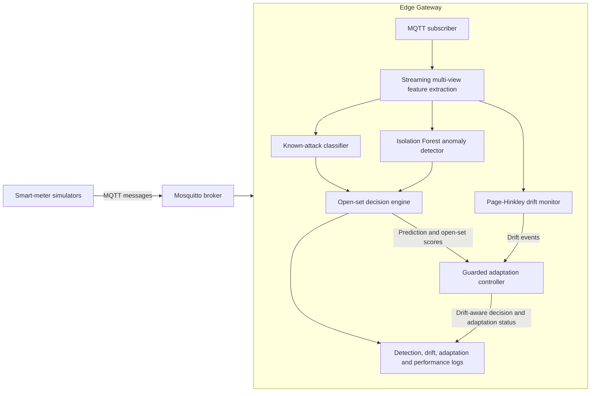

# Lightweight Multi-View and Drift-Aware Edge Framework for FDI Detection

This repository implements an MSc dissertation prototype for detecting known
and previously unseen false-data injection attacks in smart-grid IoT
communications. MQTT measurement values, temporal behaviour and protocol-level
context are analysed at an edge gateway. The framework also provides
Page-Hinkley drift monitoring and guarded statistical adaptation.

## Research question

> Can a lightweight edge-based detector identify known and previously unseen
> false-data injection attacks by jointly analysing IoT message values,
> temporal behaviour and protocol-level communication patterns?

## Implemented contributions

- MQTT smart-meter testbed with three simulated devices and Mosquitto.
- Constant, random, replay and topic-spoof known attacks.
- Gradual manipulation excluded from training and evaluated as unseen.
- Value, temporal and MQTT protocol feature views.
- Grouped train/validation/test splits by independent scenario run.
- Logistic Regression and Random Forest known-attack comparison.
- Confidence rejection plus a normal-only Isolation Forest for open-set detection.
- Real-time MQTT edge detector with latency and resource logging.
- Two-sided Page-Hinkley measurement and communication drift monitoring.
- Guarded candidate-window adaptation and poisoning-resistance evaluation.
- Controlled MacBook evaluation as an emulated edge gateway.

## Architecture



The drift monitor is a side-path component. It does not retrain the classifier
inside the packet-processing path. Adaptation requires drift approval, trusted
samples, a minimum candidate window and bounded reference updates.

## Feature views

| View | Examples | Primary attack evidence |
|---|---|---|
| Value | raw values, differences, rolling mean/std, z-score, power consistency | constant, random and gradual manipulation |
| Temporal | publish/arrival interval, sequence gap, duplicate/out-of-order, repeated-value runs | replay and timing behaviour |
| Protocol | MQTT topic, QoS, retain, payload size, device-topic and client-topic relationships | topic spoofing and communication anomalies |

### Feature visibility by observation level

| Feature | Device | Edge gateway | Application/logger |
|---|:---:|:---:|:---:|
| Voltage, current, power and frequency | Yes | Yes | Yes |
| Device timestamp and sequence number | Yes | Yes | Yes |
| Source publish interval | Yes | Yes | Yes |
| Gateway inter-arrival time | No | Yes | Yes |
| Transport-delay estimate | No | Yes | Yes |
| MQTT topic and QoS | Yes | Yes | Yes |
| Retain flag and payload size | Partial | Yes | Yes |
| Duplicate/out-of-order sequence evidence | Partial | Yes | Yes |
| Device-topic/client-topic relationship | No | Yes | Partial |
| Model confidence and anomaly score | No | Yes | Yes |
| Drift and adaptation status | No | Yes | Yes |

## Environment

Requirements:

- Python 3.11
- Mosquitto broker and command-line clients
- Conda or another Python environment manager

Create the environment:

```bash
conda env create -f environment.yml
conda activate smartgrid-fdi
python -m pytest -q
```

## MQTT smoke test

Terminal 1:

```bash
mosquitto -v
```

Terminal 2:

```bash
python scripts/collect_dataset.py \
  --output data/raw/normal_smoke.csv
```

Terminal 3:

```bash
python scripts/run_simulator.py \
  --scenario config/scenarios/normal.yaml \
  --duration 20 \
  --interval 0.5
```

Available attack scenarios include `normal.yaml`, `constant.yaml`,
`random.yaml`, `replay.yaml`, `topic_spoof.yaml` and `gradual.yaml`.

## Dataset and model pipeline

Generate reproducible scenarios and collect them through MQTT:

```bash
make scenarios
make collect
```

Build and validate multi-view features:

```bash
make features
make validate
```

Run the research experiments:

```bash
make ablation
make open-set
make compare-models
make repeated-experiments
make drift
make drift-repeated
make drift-phases
make final-summary
```

`make experiments` runs the complete offline experiment suite when the formal
dataset and local model artifacts are available.

`make drift-phases` analyses the two labelled live MQTT drift trials as
baseline, pre-detection, detected-before-reference-update, post-update,
recovery, and unaffected-control phases. The resulting alert-rate and latency
table is written to `results/drift/live_mqtt_phase_metrics.csv`. In the current
prototype, guarded adaptation updates statistical references and permits an
approved `normal_drift` operational decision; it does not retrain or recalibrate
the classifier, scaler, or Isolation Forest in the packet-processing path.

After collecting five independent `measurement_drift` and five independent
`communication_drift` MQTT trials under `results/edge/repeated_live/`, run:

```bash
make drift-live-repeated-summary
```

This preserves every trial as an independent run and writes overall and
phase-wise run tables plus mean/sample-standard-deviation summaries under
`results/drift/repeated_live/`. Recovery remains a separate phase because a
reverse-drift event can temporarily renew guarded approval after the labelled
drift interval ends.

`make repeated-experiments` repeats the ablation, Logistic Regression versus
Random Forest, and open-set experiments with the grouped-split seeds configured
in `config/repeated_experiments.yaml`. It writes per-run values and
mean/sample-standard-deviation/minimum/maximum summaries to `results/repeated/`.
These runs are repeated grouped holdouts, not k-fold cross-validation. Use a
partial run for development with, for example:

```bash
python scripts/run_repeated_experiments.py \
  --sections open_set \
  --seeds 42
```

Repeat the MacBook streaming benchmark for the fixed Logistic Regression and
Random Forest deployment artifacts:

```bash
make edge-benchmark-repeated
```

Each model/run executes in a fresh process over the same raw message stream.
The first 34 messages from each device (102 total) warm the stateful feature
pipeline and are excluded from timing. The two model orders alternate between
runs. Results are saved under
`results/edge/repeated/`. This is a known-attack classifier cost comparison;
the separate `edge-benchmark` command measures the complete open-set pipeline,
including Isolation Forest scoring.

Repeat that complete Logistic Regression plus Isolation Forest open-set
pipeline with the same per-device warm-up policy:

```bash
make open-set-edge-benchmark-repeated
```

After copying the five-run Raspberry Pi summaries into
`results/edge/raspberry_pi/`, generate the cross-platform table and figure:

```bash
make platform-comparison
```

Maximum-throughput benchmarks intentionally keep one CPU core saturated. To
measure CPU utilisation under the same realistic incoming load, run the
fixed-rate benchmark at 3, 10 and 25 messages/s:

```bash
make fixed-rate-edge-benchmark
```

The fixed-rate runner executes Logistic Regression, Random Forest and the full
open-set pipeline in fresh processes for five repetitions. It reports process
CPU as both single-core equivalent utilisation and percentage of total logical
machine capacity, CPU time per message, missed processing deadlines, latency,
memory and (on Raspberry Pi) temperature and throttling state. Use
`config/raspberry_pi_fixed_rate_edge_benchmark.yaml` on the Pi.

The formal normal MQTT topology produces six messages/s in total (three
devices, each publishing every 0.5 seconds). Measure CPU at that exact rate
using only normal messages on the MacBook with:

```bash
make normal-load-cpu-benchmark
```

Run the same command on the Raspberry Pi by invoking
`scripts/run_fixed_rate_edge_benchmark.py` with
`config/raspberry_pi_normal_load_cpu_benchmark.yaml`. After copying the Pi
summary back to `results/edge/normal_load_cpu/raspberry_pi_summary.csv`, run:

```bash
make normal-load-cpu-platform-comparison
```

This dedicated experiment does not overwrite the 3/10/25 messages/s load
summaries and must not be described as a maximum-throughput benchmark. The
cross-platform plotting configuration combines the independent 6 messages/s
summary with the 3/10/25 messages/s rate sweep only in a derived table and
figure; the normal-load point is explicitly identified in both outputs.

## Real-time edge detector

Train the open-set artifacts first:

```bash
make open-set
```

With Mosquitto running, start the detector:

```bash
make edge-detector
```

Then publish any configured scenario from a separate terminal:

```bash
python scripts/run_simulator.py \
  --scenario config/scenarios/topic_spoof.yaml
```

The formal Raspberry Pi live-MQTT scenarios use dedicated configurations with
the same 0.5-second publishing interval as the model-development dataset:

```bash
python scripts/run_simulator.py \
  --scenario config/scenarios/live_pi_normal.yaml

python scripts/run_simulator.py \
  --scenario config/scenarios/live_pi_constant.yaml

python scripts/run_simulator.py \
  --scenario config/scenarios/live_pi_replay.yaml

python scripts/run_simulator.py \
  --scenario config/scenarios/live_pi_topic_spoof.yaml

python scripts/run_simulator.py \
  --scenario config/scenarios/live_pi_gradual_extended.yaml
```

Do not substitute the one-second development scenarios for this evaluation.
Changing the publishing interval changes temporal features and constitutes a
communication-rate distribution shift rather than a matched deployment test.

Per-message output includes the known prediction, open-set decision,
confidence, anomaly score, drift status and feature/model/total latency. When
the guarded drift controller is enabled, `raw_decision` preserves the original
model output and `drift_aware_decision` records the separately guarded
operational decision.

## MQTT drift scenarios

Two legitimate drift scenarios are provided:

```bash
python scripts/run_simulator.py \
  --scenario config/scenarios/measurement_drift.yaml
```

```bash
python scripts/run_simulator.py \
  --scenario config/scenarios/communication_drift.yaml
```

They use independent `drift_type`, `drift_active` and `drift_step` ground-truth
fields while retaining `attack_type=none`.

Drift monitoring and adaptation are disabled by default in `config/edge.yaml`.
For a controlled deployment, enable `drift.enabled`. Adaptation should remain
manual (`auto_approve: false`) unless the experiment explicitly evaluates
automatic approval.

For the two labelled MQTT drift trials, use the dedicated experimental config:

```bash
python scripts/run_edge_detector.py \
  --config config/edge_drift_experiment.yaml \
  --output results/edge/mqtt_measurement_drift_v2.csv
```

Restart the detector between scenarios so its feature windows, drift detectors
and temporary approvals are reset. Use a different output file for the
communication trial. Summarise both completed logs with:

```bash
python scripts/summarize_mqtt_drift.py \
  results/edge/mqtt_measurement_drift_v2.csv \
  results/edge/mqtt_communication_drift_v2.csv \
  --output results/drift/live_mqtt_summary.json
```

For the equivalent Raspberry Pi trial, use
`config/raspberry_pi_edge_drift_experiment.yaml` for five independent runs of
each scenario, store the logs under
`results/edge/raspberry_pi/repeated_drift/`, and aggregate them into
`results/drift/raspberry_pi_repeated_live/`. Once both five-run platform
summaries are present, generate the labelled dissertation table and figure:

```bash
make drift-platform-comparison
```

This config enables automatic drift approval only for controlled experiments.
The production-style `config/edge.yaml` keeps automatic approval disabled. The
experimental approvals expire after a bounded number of device messages.
Protocol-integrity checks, anomaly-score limits, confidence requirements and a
minimum history are still enforced. A confirmed and approved legitimate change
may produce `normal_drift`; it never overwrites the recorded raw decision.

The online voltage threshold was calibrated on five independent normal MQTT runs:
zero normal-drift alerts were observed at a threshold of 220, while a +5V
measurement shift was detected 40 messages after its configured start in all
five calibration replays.

## Key results

| Experiment | Result |
|---|---:|
| All-view Logistic Regression Macro-F1 | 0.99735 |
| Random Forest Macro-F1 | 0.99952 |
| Excluded gradual attack unknown recall | 0.9500 |
| Open-set unknown precision | 0.8962 |
| MacBook mean edge latency | 6.76 ms |
| MacBook P95 edge latency | 6.96 ms |
| MacBook maximum replay throughput | 147.75 messages/s |
| Raspberry Pi open-set mean latency, five-run benchmark | 29.99 ms |
| Raspberry Pi open-set maximum replay throughput | 33.34 messages/s |
| Live MQTT known-attack alert rate on Raspberry Pi | 100% |
| Live MQTT known-attack exact classification rate | 96.67% |
| Live MQTT excluded-gradual unknown recall | 93.33% |
| Live MQTT pooled normal alert rate | 1.80% |
| Live MQTT weighted mean detection latency | 30.66 ms |
| Live MQTT maximum per-scenario P95 latency | 41.86 ms |
| Measurement drift delay, five-run mean | 2.0 messages |
| Communication drift delay, five-run mean | 4.8 messages |
| Guarded poisoning reference shift | 1.21 V |
| Unguarded poisoning reference shift | 7.22 V |
| Live MQTT measurement drift delay | 47 messages |
| Live MQTT measurement active-alert reduction | 25.42% |
| Live MQTT communication drift delay | 5 messages/device |
| Live MQTT communication active-alert reduction | 99.11% |
| Raspberry Pi measurement-drift mean latency, five runs | 31.21 ± 0.12 ms |
| Raspberry Pi communication-drift mean latency, five runs | 31.45 ± 0.19 ms |
| Raspberry Pi measurement-drift delay, five runs | 47.2 ± 0.45 messages |
| Raspberry Pi communication-drift delay, five runs | 5.0 ± 0.0 messages/device |
| Raspberry Pi measurement alert reduction, five runs | 19.13 ± 4.49% |
| Raspberry Pi communication alert reduction, five runs | 99.11 ± 0.0% |
| Raspberry Pi maximum observed drift-trial temperature | 60.9 C |
| Raspberry Pi throttling status at all 12 recorded checkpoints | `0x0` (none) |
| MacBook open-set CPU at normal 6 msg/s | 13.64 ± 0.61% of one logical core |
| Raspberry Pi open-set CPU at normal 6 msg/s | 23.50 ± 0.51% of one logical core |
| Normal-load deadline misses on both platforms | 0 |
| Raspberry Pi normal-load temperature before/after | 47.2 / 48.3 C |
| Raspberry Pi normal-load throttling status before/after | `0x0` (none) |

The consolidated machine-readable results are generated under `results/final/`.
The dissertation-ready Raspberry Pi live-MQTT table is written to
`results/final/live_mqtt_deployment_table.csv`. The formal live deployment
used 3,228 messages across five scenarios. Constant, replay and topic-spoof
attacks were all alerted; gradual manipulation was excluded from training and
was therefore evaluated by its `unknown` decision rate.
The labelled live MQTT drift summary is stored in
`results/drift/live_mqtt_summary.json`. A return to the original operating
condition is reported separately as a recovery phase because it constitutes a
second, reverse distribution change rather than an ordinary false alarm.
The repeated Raspberry Pi drift summary and MacBook comparison are stored in
`results/drift/raspberry_pi_repeated_live/` and
`results/drift/platform_comparison.csv`. Five-run functional results were
closely aligned across platforms: measurement delay was 47.0 messages on the
MacBook and 47.2 on the Pi, while communication delay was 4.8 and 5.0 messages.
The Raspberry Pi was approximately 2.04 to 2.06 times slower than the MacBook
for these complete drift-aware trials. Firmware status was `throttled=0x0` at
all 12 recorded thermal checkpoints, so no current or historical
throttling/undervoltage condition was recorded during this evaluation.

## Reproducibility and generated files

Raw MQTT datasets, complete prediction logs and trained Joblib artifacts are
not committed because they are generated and may be large. Configuration,
ordered model metadata, metrics summaries and selected figures are retained.
Run the corresponding `make` targets to regenerate local artifacts.

## Edge hardware evaluation

The fixed deployment artifacts and identical raw message stream were evaluated
on both an Apple Silicon MacBook and a 64-bit Raspberry Pi 5 Model B. Repeated
benchmarks report latency, throughput, process CPU and peak resident memory;
Raspberry Pi runs also record temperature and firmware throttling state. Direct
electrical energy consumption is not claimed because no external power meter
was used.
