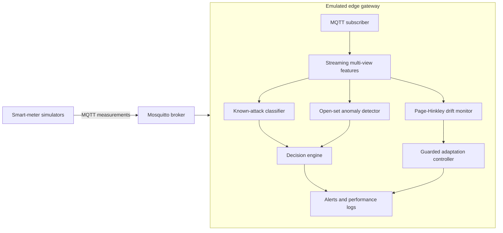

# Lightweight Multi-View and Drift-Aware Edge Framework for FDI Detection

This repository implements an MSc dissertation prototype for detecting known
and previously unseen false-data injection attacks in smart-grid IoT
communications. MQTT measurement values, temporal behaviour and protocol-level
context are analysed at an edge gateway. The framework also provides
Page-Hinkley drift monitoring and guarded statistical adaptation.

## Research question

> Can a lightweight edge-based detector identify known and previously unseen
> false-data injection attacks by jointly analysing IoT message values,
> temporal behaviour and protocol-level communication patterns?

## Implemented contributions

- MQTT smart-meter testbed with three simulated devices and Mosquitto.
- Constant, random, replay and topic-spoof known attacks.
- Gradual manipulation excluded from training and evaluated as unseen.
- Value, temporal and MQTT protocol feature views.
- Grouped train/validation/test splits by independent scenario run.
- Logistic Regression and Random Forest known-attack comparison.
- Confidence rejection plus a normal-only Isolation Forest for open-set detection.
- Real-time MQTT edge detector with latency and resource logging.
- Two-sided Page-Hinkley measurement and communication drift monitoring.
- Guarded candidate-window adaptation and poisoning-resistance evaluation.
- Controlled MacBook evaluation as an emulated edge gateway.

## Architecture



The drift monitor is a side-path component. It does not retrain the classifier
inside the packet-processing path. Adaptation requires drift approval, trusted
samples, a minimum candidate window and bounded reference updates.

## Feature views

| View | Examples | Primary attack evidence |
|---|---|---|
| Value | raw values, differences, rolling mean/std, z-score, power consistency | constant, random and gradual manipulation |
| Temporal | publish/arrival interval, sequence gap, duplicate/out-of-order, repeated-value runs | replay and timing behaviour |
| Protocol | MQTT topic, QoS, retain, payload size, device-topic and client-topic relationships | topic spoofing and communication anomalies |

### Feature visibility by observation level

| Feature | Device | Edge gateway | Application/logger |
|---|:---:|:---:|:---:|
| Voltage, current, power and frequency | Yes | Yes | Yes |
| Device timestamp and sequence number | Yes | Yes | Yes |
| Source publish interval | Yes | Yes | Yes |
| Gateway inter-arrival time | No | Yes | Yes |
| Transport-delay estimate | No | Yes | Yes |
| MQTT topic and QoS | Yes | Yes | Yes |
| Retain flag and payload size | Partial | Yes | Yes |
| Duplicate/out-of-order sequence evidence | Partial | Yes | Yes |
| Device-topic/client-topic relationship | No | Yes | Partial |
| Model confidence and anomaly score | No | Yes | Yes |
| Drift and adaptation status | No | Yes | Yes |

## Environment

Requirements:

- Python 3.11
- Mosquitto broker and command-line clients
- Conda or another Python environment manager

Create the environment:

```bash
conda env create -f environment.yml
conda activate smartgrid-fdi
python -m pytest -q
```

## MQTT smoke test

Terminal 1:

```bash
mosquitto -v
```

Terminal 2:

```bash
python scripts/collect_dataset.py \
  --output data/raw/normal_smoke.csv
```

Terminal 3:

```bash
python scripts/run_simulator.py \
  --scenario config/scenarios/normal.yaml \
  --duration 20 \
  --interval 0.5
```

Available attack scenarios include `normal.yaml`, `constant.yaml`,
`random.yaml`, `replay.yaml`, `topic_spoof.yaml` and `gradual.yaml`.

## Dataset and model pipeline

Generate reproducible scenarios and collect them through MQTT:

```bash
make scenarios
make collect
```

Build and validate multi-view features:

```bash
make features
make validate
```

Run the research experiments:

```bash
make ablation
make open-set
make compare-models
make repeated-experiments
make drift
make drift-repeated
make final-summary
```

`make experiments` runs the complete offline experiment suite when the formal
dataset and local model artifacts are available.

`make repeated-experiments` repeats the ablation, Logistic Regression versus
Random Forest, and open-set experiments with the grouped-split seeds configured
in `config/repeated_experiments.yaml`. It writes per-run values and
mean/sample-standard-deviation/minimum/maximum summaries to `results/repeated/`.
These runs are repeated grouped holdouts, not k-fold cross-validation. Use a
partial run for development with, for example:

```bash
python scripts/run_repeated_experiments.py \
  --sections open_set \
  --seeds 42
```

## Real-time edge detector

Train the open-set artifacts first:

```bash
make open-set
```

With Mosquitto running, start the detector:

```bash
make edge-detector
```

Then publish any configured scenario from a separate terminal:

```bash
python scripts/run_simulator.py \
  --scenario config/scenarios/topic_spoof.yaml
```

Per-message output includes the known prediction, open-set decision,
confidence, anomaly score, drift status and feature/model/total latency. When
the guarded drift controller is enabled, `raw_decision` preserves the original
model output and `drift_aware_decision` records the separately guarded
operational decision.

## MQTT drift scenarios

Two legitimate drift scenarios are provided:

```bash
python scripts/run_simulator.py \
  --scenario config/scenarios/measurement_drift.yaml
```

```bash
python scripts/run_simulator.py \
  --scenario config/scenarios/communication_drift.yaml
```

They use independent `drift_type`, `drift_active` and `drift_step` ground-truth
fields while retaining `attack_type=none`.

Drift monitoring and adaptation are disabled by default in `config/edge.yaml`.
For a controlled deployment, enable `drift.enabled`. Adaptation should remain
manual (`auto_approve: false`) unless the experiment explicitly evaluates
automatic approval.

For the two labelled MQTT drift trials, use the dedicated experimental config:

```bash
python scripts/run_edge_detector.py \
  --config config/edge_drift_experiment.yaml \
  --output results/edge/mqtt_measurement_drift_v2.csv
```

Restart the detector between scenarios so its feature windows, drift detectors
and temporary approvals are reset. Use a different output file for the
communication trial. Summarise both completed logs with:

```bash
python scripts/summarize_mqtt_drift.py \
  results/edge/mqtt_measurement_drift_v2.csv \
  results/edge/mqtt_communication_drift_v2.csv \
  --output results/drift/live_mqtt_summary.json
```

This config enables automatic drift approval only for controlled experiments.
The production-style `config/edge.yaml` keeps automatic approval disabled. The
experimental approvals expire after a bounded number of device messages.
Protocol-integrity checks, anomaly-score limits, confidence requirements and a
minimum history are still enforced. A confirmed and approved legitimate change
may produce `normal_drift`; it never overwrites the recorded raw decision.

The online voltage threshold was calibrated on five independent normal MQTT runs:
zero normal-drift alerts were observed at a threshold of 220, while a +5V
measurement shift was detected 40 messages after its configured start in all
five calibration replays.

## Key results

| Experiment | Result |
|---|---:|
| All-view Logistic Regression Macro-F1 | 0.99735 |
| Random Forest Macro-F1 | 0.99952 |
| Excluded gradual attack unknown recall | 0.9500 |
| Open-set unknown precision | 0.8962 |
| MacBook mean edge latency | 6.76 ms |
| MacBook P95 edge latency | 6.96 ms |
| MacBook maximum replay throughput | 147.75 messages/s |
| Measurement drift delay, five-run mean | 2.0 messages |
| Communication drift delay, five-run mean | 4.8 messages |
| Guarded poisoning reference shift | 1.21 V |
| Unguarded poisoning reference shift | 7.22 V |
| Live MQTT measurement drift delay | 47 messages |
| Live MQTT measurement active-alert reduction | 25.42% |
| Live MQTT communication drift delay | 5 messages/device |
| Live MQTT communication active-alert reduction | 99.11% |

The consolidated machine-readable results are generated under `results/final/`.
The labelled live MQTT drift summary is stored in
`results/drift/live_mqtt_summary.json`. A return to the original operating
condition is reported separately as a recovery phase because it constitutes a
second, reverse distribution change rather than an ordinary false alarm.

## Reproducibility and generated files

Raw MQTT datasets, complete prediction logs and trained Joblib artifacts are
not committed because they are generated and may be large. Configuration,
ordered model metadata, metrics summaries and selected figures are retained.
Run the corresponding `make` targets to regenerate local artifacts.

## Deployment limitation

The real-time framework was implemented and evaluated on an Apple Silicon
MacBook acting as an **emulated edge gateway**. The repository does not claim
Raspberry Pi hardware, energy or thermal measurements. Raspberry Pi latency,
resource and energy comparison remains future hardware validation.
